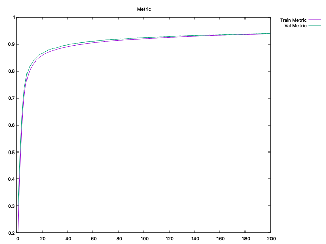
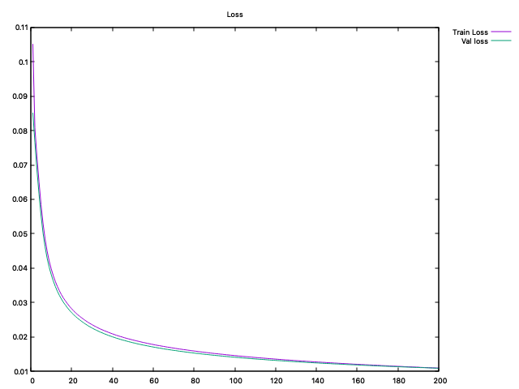
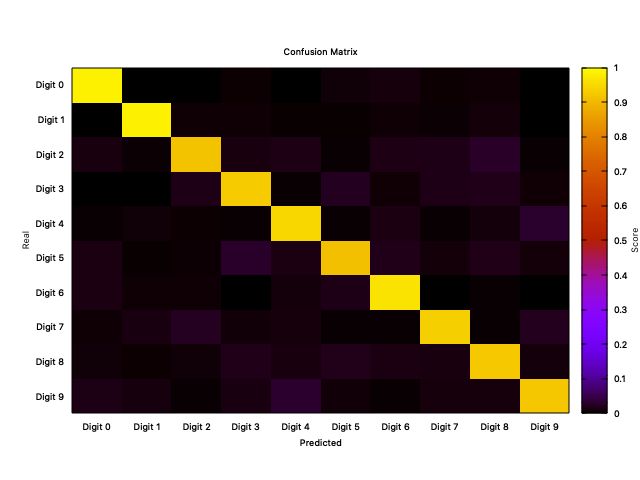

# CNet

Neural Network written in C (STD C11).
The main goal is to understand artificial neural networks by building one from scratch and training over the MNIST dataset. As a separate goal, I tried to create the **cnet** interface as flexible as possible, with the possibility to work with several layers, activations and losses. 

## DISCLAIMER

This is not a serious project, it hasn't been fully tested, nor it will be mantained. The objective was to understand anns and that's all. [GENANN is a serious project](https://github.com/codeplea/genann) that can be used, seriously.

## MNIST

The [mnist folder](./mnist) contains code to test the cnet library over the [mnist dataset](http://yann.lecun.com/exdb/mnist/).

It contains two main scripts: *train* and *test*. The *train* file contains code to train the model, the output is be saved into [the mnist out folder.](./mnist/out), including the saved model and the history file (containing loss and accuracy). 

The *test* file contains code to test the saved model over the test-set and creates different reports. The reports are saved into the `mnist/out` folder, and contains
- a confusion matrix saved into `mnist/out/conf.dat` that can be visualized using [this gnuplot script](./plots/confusion_matrix.plt).
- a classification report, which includes precision, recall, f1-score and support for each of the digits.

Currently, the model reaches **0.94** accuracy over the mnist test-set within 200 epochs (~5hs).
The training is pretty slow as it uses SGD (batches with a single training sample) and does not use any optimization, such as momentum.

### MNIST HISTORY

| accuracy | loss |
| --- | --- |
|  |  |

### MNIST CONFUSION MATRIX




### MNIST REPORT

```
CLASSIFICATION REPORT 

         precision  recall     f1-score   support 
Digit 0  0.951533  0.981633  0.966349  980 
Digit 1  0.973753  0.980617  0.977173  1135 
Digit 2  0.948744  0.914729  0.931426  1032 
Digit 3  0.931480  0.928713  0.930094  1010 
Digit 4  0.925224  0.945010  0.935013  982 
Digit 5  0.928981  0.909193  0.918980  892 
Digit 6  0.933131  0.961378  0.947044  958 
Digit 7  0.947628  0.932879  0.940196  1028 
Digit 8  0.919140  0.921971  0.920554  974 
Digit 9  0.936492  0.920714  0.928536  1009 


Final Accuracy: 0.940300 - Samples: 10000
```


## BUILD

The generated files will be saved in the following folders:

- **bin/obj**: object files for library
- **bin/lib**: cnet static library
- **bin/exec**: all executable files

The [Makefile](Makefile) provides the following targets:

- **cnet**: Builds the cnet static library
- **integration-tests**: Builds a quick integration test
- **mnist-train**: Trains a model on the mnist dataset (see [the mnist section](#mnist))
- **mnist-test**: Uses the saved model to predict over the mnist testset (see [the mnist section](#mnist))

## LIB

The project builds a static library that provides several functions, these will all start with the *cnet_* (general purpose functions) or *nn_* (network specific functions) prefix and they can be found in the [cnet header](./cnet/include/cnet.h). The most important functions are:

- **nn_init**: intialize a cnet model
- **nn_free**: free the initialized memory for a cnet model
- **nn_add**: adds a layer to the model
- **nn_predict**: predict over a single sample
- **nn_train**: trains the model over the given hyperparameters, this function also saves the history into a given file. This history can be displayed using the [metrics plot script](./plots/metrics.plt) using gnuplot.
- **nn_save**: save the model into a given file
- **nn_load**: load the model from a given file


## RESOURCES

To create this project I used the following resources as guide:

- [3Blue1Brown](https://www.youtube.com/watch?v=aircAruvnKk&t=764s)
- [DeepLizard](https://www.youtube.com/watch?v=gZmobeGL0Yg&list=PLZbbT5o_s2xq7LwI2y8_QtvuXZedL6tQU)
- [NN in C by Santiago Becerra](https://towardsdatascience.com/simple-neural-network-implementation-in-c-663f51447547)
- [GENANN](https://github.com/codeplea/genann/blob/master/genann.c)
- [MINST-CNN-99.5 implementation](https://github.com/cdeotte/MNIST-CNN-99.5)
- [MNIST Dataset Loader for C++](https://github.com/takafumihoriuchi/MNIST_for_C)
- [ANN Implementation in C++](https://github.com/fllaryora/ANN)
